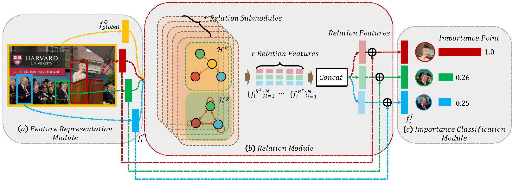

## POINT 
This repository contains an official pytorch implementation for the following paper: 
[Learning to Learn Relation for Important People Detection in Still Images (CVPR 2019)](http://weihonglee.github.io/Projects/POINT/POINT.htm). [Wei-Hong Li](https://weihonglee.github.io/), Fa-Ting Hong, [Wei-Shi Zheng](http://isee.sysu.edu.cn/~zhwshi/)

POINT, deep im**PO**rtance relat**I**on **N**e**T**work, is the first to investigate deep learning for exploring and encoding the relation features and exploiting them for important ppeople detection and achieves state-of-the-art performance on two public datasets for which verify its efficacy for important people detection.
<!--TODO-->
### **Citation**
Please kindly cite our paper (and the respective papers of the methods used) if you use this code in your own work:  
[Wei-Hong Li](https://weihonglee.github.io/), Fa-Ting Hong, [Wei-Shi Zheng](http://www.isee-ai.cn/~zhwshi/index.html), "Learning to Learn Relation for Important People Detection in Still Images", In CVPR, 2019.

bib:

    @inproceedings{li2019point,
     title={Learning to Learn Relation for Important People Detection in Still Images},
     author={li, Wei-Hong and Hong, Fa-Ting and Zheng, Wei-Shi},
     year={2019},
     booktitle={IEEE International Conference on Computer Vision and Pattern Recognition (CVPR)},
    }
### **Dependencies**
    1.Pytorch 1.0.0
    2.Python 3.6+
    3.Python packages: numpy, scipy, pyyaml/yaml, h5py, opencv, PIL

### **DataSet**
In this work, we apply our algrithm to the MS Dataset and NCAA Dataset, and achieve satisfactory results. 

Download the [MS/NCAA Dataset](https://weihonglee.github.io/Projects/PersonRank.htm), and unzip it into /data. After this step, you should have a folder structure:

    - MSDataset/NCAADataset
        - data
        - images
        - README.md
### **Data Prepare**

As we mentioned in the paper, we use the interior and exterior patches and the location heat map. To train the POINT, we first extract those patches from the original images. As the detectors used to detect persons in MS Dataset and NCAA Dataset are different, we provide two script to extract those patches:

    python GetMSImageFace.py (For Ms Dataset)
**or**

    python GetNCAAImageFace.py (For NCAA Dataset)
The picture below is an illustration of extracting the exterior patch on the MS Dataset (left) and the NCAA Dataset (right).

### **Train**
Run the below conmmand to train the POINT 

    python POINT_train.py --h 4 --N 2
where "--h 4 " specifies the number of relation submodule and the "--N 2" for the number of relation module.

### **Test**

To test the trained model, we provide a script to evaluate the important people detection performance on the testing set. After testing, both mAP and CMC are calculated.

    python POINT_test.py --index_name ./data/MSindex.npy --dataset_path ./data/MSDataSet_process--model MS_h4_N2.pkl --h 4 --N 2 
    
    --index_name   the index of train, val and test set
    --dataset_path   the path of dataset
    --model    which model to run
    --h   the number of Relation-Submodule in relation-module
    --N   the number of Relation-Module

### **Our Trained Model**

We provide our [trained models](https://uoe-my.sharepoint.com/:f:/g/personal/s1798461_ed_ac_uk/Ej3oCyjKp65JnLb_auoNgZ8BuwPuDTiMqzHN6YbjNfTUow?e=F8lcOl) (both on the MS Dataset and NCAA Dataset) and you can use the trained model directly.

### **Results**

We also provide [results (CMC)](https://uoe-my.sharepoint.com/:f:/g/personal/s1798461_ed_ac_uk/EkwsFYZPPNpJsYR1DOIkIL4BqAmNqnpoGU9GEtMrqXDx2Q?e=RWiq68) of compared methods and Our POINT on both datasets. You can use these results directly.

